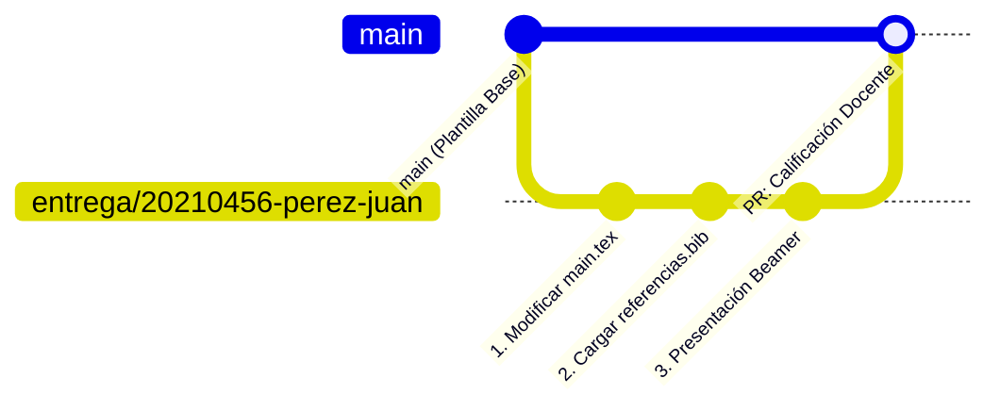

# 📂 Trabajo Final - Proyecto de Investigación Modelo (LaTeX & Beamer)

### Taller Introductorio de Overleaf (LaTeX) para la Redacción Académica · Semestre 2026-2
**Instructor:** Enmanuel Huallparimachi *(Ciencia Política · Facultad de Ciencias Sociales · PUCP)*

---

## 🎯 Propósito de este Directorio

Esta carpeta contiene el **proyecto modelo oficial de referencia** del curso, desarrollado a partir del trabajo de investigación empírica del instructor:

> 📄 ***<<Incidencia de iconografía populista punitiva en la cooperación ciudadana frente a políticas de mano dura contra el crimen: Una propuesta experimental>>***  
> 👨‍🏫 **Autor:** Enmanuel Huallparimachi Rojas  
> 🔗 **Proyecto en Overleaf:** [https://www.overleaf.com/read/gqktyspwvydm](https://www.overleaf.com/read/gqktyspwvydm)

---

## 📁 Archivos de la Plantilla

| Archivo / Carpeta | Tipo | Descripción |
|---|:---:|---|
| [`main.tex`](main.tex) | LaTeX `.tex` | Manuscrito académico estructurado: preámbulo, resumen, secciones, modelo econométrico formal ($ATE$), tablas con `booktabs`, apéndices y bibliografía. |
| [`referencias.bib`](referencias.bib) | BibTeX `.bib` | Base de datos bibliográfica con artículos y libros de Ciencia Política y metodología. |
| [`presentacion/presentacion_beamer.tex`](presentacion/presentacion_beamer.tex) | Beamer `.tex` | Presentación de diapositivas en clase Beamer con estructura modular, temas y bloques. |
| [`imagenes/`](imagenes/) | Directorio | Carpeta para almacenar imágenes, gráficos y diagramas (`.png`, `.jpg`, `.pdf`). |

---

## 🌿 Guía Paso a Paso: Cómo Crear tu Branch y Realizar tu Entrega

Para que los más de 60 estudiantes puedan entregar sus trabajos de forma ordenada y recibir retroalimentación personalizada del docente sin colisionar en la rama principal (`main`), cada estudiante trabajará en su **propia rama (*branch*)**.



---

### 🏷️ Regla Obligatoria: Formato del Nombre de tu Rama

Tu rama debe nombrarse obligatoriamente de la siguiente manera (todo en minúsculas y sin tildes ni espacios):

$$\mathbf{\text{entrega/CODIGO-APELLIDO-NOMBRE}}$$

**Ejemplos válidos:**
* `entrega/20210456-perez-juan`
* `entrega/20193821-flores-maria`
* `entrega/20205543-huaman-carlos`

---

### 💻 Opción A: Desde la Terminal (Git CLI / VS Code / PowerShell / Git Bash)

#### Paso 1. Clonar el repositorio en tu computadora
Abre tu terminal y ejecuta:
```bash
git clone https://github.com/Enmanuel-HR/Taller-introductorio-de-Overleaf-LaTex-para-la-Redaccion-Academica-2026-2.git
cd Taller-introductorio-de-Overleaf-LaTex-para-la-Redaccion-Academica-2026-2
```

#### Paso 2. Asegurarte de estar en la rama principal actualizada
```bash
git checkout main
git pull origin main
```

#### Paso 3. Crear y posicionarte en tu rama personal (*branch*)
```bash
# Reemplaza con TU código PUCP, apellido y nombre:
git checkout -b entrega/20210456-perez-juan
```
> 💡 *El comando `-b` crea la rama y te cambia a ella inmediatamente. Puedes verificar que estás en tu rama ejecutando `git branch`.*

#### Paso 4. Trabajar en tu manuscrito y presentación
1. Abre los archivos [`main.tex`](main.tex), [`referencias.bib`](referencias.bib) o [`presentacion/presentacion_beamer.tex`](presentacion/presentacion_beamer.tex) en tu editor preferido o cópialos a tu proyecto de Overleaf.
2. Adapta el contenido con tu tema de investigación, tus ecuaciones, figuras y bibliografía.
3. Asegúrate de que el documento **compile al 100% sin errores**.

#### Paso 5. Guardar tus cambios localmente (*Commit*)
```bash
# Ver los archivos modificados
git status

# Agregar todos los archivos preparados para guardar
git add .

# Crear el commit con un mensaje claro
git commit -m "📝 Entrega de manuscrito académico y referencias bibliográficas"
```

#### Paso 6. Subir tu rama a GitHub (*Push*)
```bash
# Sube tu rama personal al repositorio remoto:
git push -u origin entrega/20210456-perez-juan
```

#### Paso 7. Abrir tu Pull Request (PR) en GitHub
1. Ve al repositorio en el navegador:  
   👉 **[Repositorio en GitHub](https://github.com/Enmanuel-HR/Taller-introductorio-de-Overleaf-LaTex-para-la-Redaccion-Academica-2026-2)**
2. Aparecerá una barra amarilla con el botón verde **<<Compare & pull request>>** correspondiente a tu rama.
3. Haz clic en él. Se cargará automáticamente el **Formulario de Entrega** (`pull_request_template.md`).
4. Completa tus datos (Código PUCP, enlace a tu proyecto en Overleaf y marca los ítems del checklist de autoevaluación).
5. Haz clic en **<<Create Pull Request>>**. ¡Listo!

---

### 🌐 Opción B: Directamente desde la Web de GitHub (Sin Terminal)

Si aún no tienes Git instalado localmente, puedes crear tu branch desde la página web de GitHub:

1. **Entrar al repositorio:** [GitHub Repo](https://github.com/Enmanuel-HR/Taller-introductorio-de-Overleaf-LaTex-para-la-Redaccion-Academica-2026-2).
2. **Crear la rama:**
   * Haz clic en el botón desplegable que dice **`main`** (ubicado arriba a la izquierda de la lista de archivos).
   * En el cuadro de texto que aparece, escribe el nombre de tu rama: `entrega/CODIGO-APELLIDO-NOMBRE`.
   * Haz clic en **<<Create branch: entrega/... from 'main'>>**.
3. **Subir tus archivos modificados:**
   * Asegúrate de que en el selector de ramas esté seleccionada tu rama recién creada (`entrega/...`).
   * Navega a la carpeta correspondiente, haz clic en **<<Add file>>** → **<<Upload files>>**.
   * Arrastra tu archivo `main.tex`, tu `referencias.bib`, tus imágenes y tu PDF compilado.
   * En la parte inferior escribe un mensaje de commit (ej. *<<Subida de manuscrito final>>*) y haz clic en **<<Commit changes>>**.
4. **Abrir el Pull Request:**
   * Ve a la pestaña **<<Pull Requests>>** en la parte superior.
   * Haz clic en **<<New Pull Request>>**.
   * Asegúrate de que `base: main` y `compare: tu_rama`.
   * Completa el formulario con tu enlace de Overleaf y haz clic en **<<Create Pull Request>>**.

---

### ☁️ Opción C: Integración con Overleaf

Si trabajas 100% en Overleaf:

1. Redacta tu trabajo en Overleaf utilizando la plantilla de esta carpeta.
2. En Overleaf, ve a **Menú** (arriba a la izquierda) → **Descargar** → **Fuente (Source)** para obtener un archivo `.zip` con todos tus archivos `.tex`, `.bib` e imágenes.
3. Descomprime el `.zip` y sube los archivos a tu rama siguiendo la **Opción A** o la **Opción B**.
4. Recuerda habilitar en Overleaf el enlace de solo lectura (*Share → Turn on link sharing → View-only link*) y pegarlo en la descripción de tu Pull Request.

---

## 👨‍🏫 ¿Cómo será la retroalimentación del docente?

Una vez abierto tu Pull Request:
* El instructor (**Enmanuel Huallparimachi**) revisará tu código fuente LaTeX y la calidad tipográfica del PDF generado.
* Recibirás comentarios línea por línea directamente en el Pull Request sobre buenas prácticas, estructura de ecuaciones, manejo de tablas y citación BibTeX.
* La calificación final y observaciones se publicarán en el hilo de tu PR siguiendo la [Rúbrica de Evaluación](../evaluaciones/Rubrica_Tarea_Calificada_1.pdf).

---

<div align="center">

*Taller Introductorio de Overleaf (LaTeX) para la Redacción Académica · PUCP 2026-2*  
*Instructor: **Enmanuel Huallparimachi** (Ciencia Política · PUCP)*

</div>
