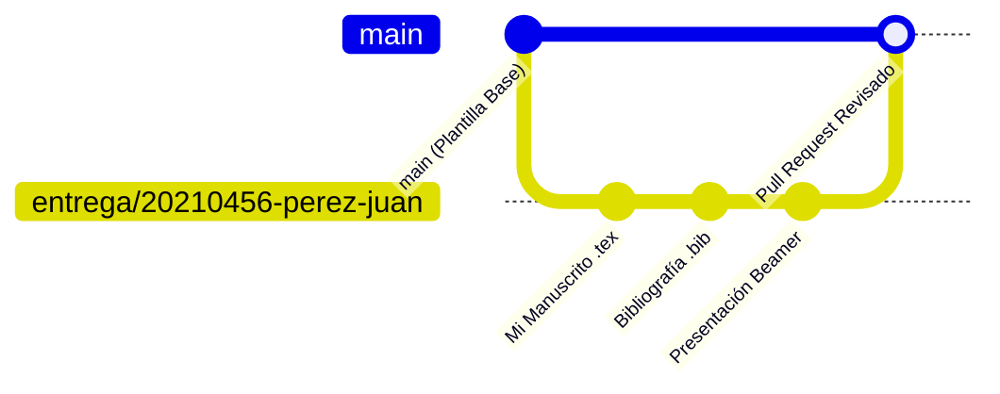

# 🌿 Guía de Entregas y Flujo de Trabajo en Git/GitHub (Branches)

### Taller Introductorio de Overleaf (LaTeX) para la Redacción Académica · 2026-2
**Instructor:** Enmanuel Huallparimachi *(Ciencia Política · PUCP)*

---

## 📌 ¿Por qué usamos ramas (Branches) para las entregas?

Con más de 60 estudiantes en el taller, trabajar todos directamente en la rama principal (`main`) generaría colisiones y conflictos de código.  
El uso de **ramas individuales por estudiante (*feature branches*)** y **Pull Requests (PRs)** permite:

1. ✅ **Aislamiento:** Cada estudiante trabaja de manera independiente en su propia rama sin afectar a sus compañeros.
2. ✅ **Historial de versiones:** Cada entrega registra exactamente cuándo y qué cambios se realizaron.
3. ✅ **Retroalimentación pedagógica:** El instructor puede revisar el código LaTeX línea por línea, dejar comentarios y asignar calificaciones directamente en el Pull Request.
4. ✅ **Experiencia profesional:** Aprendes el flujo estándar de colaboración científica y de desarrollo en software e investigación reproducible.

---

## 🏷️ Convención de Nombres para las Ramas

Cada estudiante debe nombrar su rama siguiendo estrictamente el siguiente formato:

```text
entrega/CODIGO-APELLIDO-NOMBRE
```

### Ejemplos válidos:
- `entrega/20210456-perez-juan`
- `entrega/20193821-flores-maria`
- `entrega/20205543-huaman-carlos`

---

## 🛠️ Paso a Paso para Realizar tu Entrega



---

### Paso 1: Clonar el repositorio y sincronizar

Abre tu terminal (Git Bash, PowerShell, etc.) y clona el repositorio en tu computadora:

```bash
git clone https://github.com/Enmanuel-HR/Taller-introductorio-de-Overleaf-LaTex-para-la-Redaccion-Academica-2026-2.git
cd Taller-introductorio-de-Overleaf-LaTex-para-la-Redaccion-Academica-2026-2
```

---

### Paso 2: Crear y cambiar a tu propia rama (*branch*)

Crea tu rama a partir de `main`:

```bash
# Reemplaza con tus datos reales:
git checkout -b entrega/20210456-perez-juan
```

---

### Paso 3: Trabajar en tu manuscrito y presentación

Puedes utilizar los archivos de la carpeta [`Trabajo final/`](../Trabajo%20final/) como base:

1. Edita o crea tu archivo `main.tex` con tu investigación.
2. Agrega tus citas en `referencias.bib`.
3. Si la evaluación lo requiere, crea tu presentación en `presentacion_beamer.tex`.
4. Coloca tus imágenes dentro de `imagenes/`.
5. Compila en Overleaf o localmente para asegurarte de que compile sin errores.

---

### Paso 4: Guardar tus cambios (*Commit*) y Subir tu Rama (*Push*)

Registra tus avances en Git:

```bash
# Ver archivos modificados
git status

# Agregar los archivos
git add .

# Hacer el commit con un mensaje descriptivo
git commit -m "📝 Entrega: Manuscrito académico y referencias bibliográficas"

# Subir tu rama a GitHub
git push -u origin entrega/20210456-perez-juan
```

---

### Paso 5: Abrir un Pull Request (PR) en GitHub

1. Ingresa al repositorio en GitHub:  
   [https://github.com/Enmanuel-HR/Taller-introductorio-de-Overleaf-LaTex-para-la-Redaccion-Academica-2026-2](https://github.com/Enmanuel-HR/Taller-introductorio-de-Overleaf-LaTex-para-la-Redaccion-Academica-2026-2)
2. Verás un botón verde: **<<Compare & pull request>>** con el nombre de tu rama.
3. Haz clic en él y completa la **Plantilla de Entrega** (nombre, código, enlace a Overleaf, checklist).
4. Haz clic en **<<Create Pull Request>>**.

---

## 📋 Integración Directa con Overleaf

Si prefieres trabajar directamente desde la interfaz web de Overleaf:

1. **Descarga tu proyecto** desde Overleaf como archivo `.zip` (Menú → Descargar → Fuente).
2. Descomprímelo dentro de tu carpeta de trabajo en la rama `entrega/CODIGO-APELLIDO-NOMBRE`.
3. Haz `git add`, `git commit` y `git push`.
4. Incluye siempre en la descripción de tu Pull Request el **enlace de lectura de Overleaf** (*Share → View-only link*).

---

## ❓ Preguntas Frecuentes

### ¿Puedo hacer varios commits en mi rama antes de la fecha límite?
**Sí.** Puedes hacer todos los commits y pushes que necesites en tu rama. El Pull Request se actualizará automáticamente con cada nuevo commit.

### ¿Qué pasa si cometo un error en el nombre de mi rama?
Puedes renombrarla localmente con `git branch -m nuevo-nombre` y volver a subirla con `git push -u origin nuevo-nombre`.

### ¿Quién califica y cómo recibo mi nota?
El instructor (**Enmanuel Huallparimachi**) revisará tu Pull Request, dejará comentarios sobre tu código LaTeX y publicará tu evaluación siguiendo la [Rúbrica de la Tarea](Rubrica_Tarea_Calificada_1.pdf).
